# Testing the labMT Hedonometer: From Lexicon Structure to IMDb Review Sentiment

## Project Overview

This individual resit project examines the labMT 1.0 dataset and tests how well it works as a hedonometer for analysing IMDb movie reviews.

In Part 1, I examine the labMT lexicon itself. I load and clean the dataset, check its structure, create a data dictionary, run sanity checks, and explore the distribution of happiness scores. This part is important because labMT should not be treated as a neutral black-box tool. Before using it for analysis, it is necessary to understand how it is structured, what kinds of values it contains, and what assumptions it carries.

In Part 2, I apply the cleaned labMT lexicon to IMDb movie reviews. The main research question is:

**To what extent can the labMT hedonometer distinguish between positive and negative IMDb movie reviews?**

This question allows me to test whether a word-level happiness lexicon can capture a sentiment distinction that already exists in the IMDb dataset. In other words, the project does not only apply labMT, but also evaluates how useful and limited this method is when applied to real-world review texts.

Together, the two parts form one coherent workflow: Part 1 prepares and examines the lexicon, while Part 2 tests its performance on IMDb movie reviews.
---

## Repository Structure

```text
coding-humanities-resit/
│
├── README.md
├── requirements.txt
│
├── data/
│   ├── raw/
│   │   └── Data_Set_S1.txt
│   ├── clean/
│   │   └── labMT_clean.csv
│   └── processed/
│
├── src/
│   ├── mini1_load_clean_labmt.py
│   ├── mini1_sanity_checks.py
│   ├── mini1_visualisations.py
│   └── mini1_workflow_figure.py
│
├── figures/
│   ├── mini1_workflow_diagram.png
│   ├── mini1_fig1_happiness_distribution.png
│   ├── mini1_fig2_top_10_positive_words.png
│   ├── mini1_fig3_top_10_negative_words.png
│   ├── mini1_fig4_rank_coverage_missingness.png
│   └── mini1_fig5_happiness_vs_disagreement.png
│
└── tables/
    ├── mini1_data_dictionary.csv
    ├── mini1_summary_statistics.csv
    ├── mini1_missing_values.csv
    ├── mini1_random_sample_15_rows.csv
    ├── mini1_duplicated_words_check.csv
    ├── mini1_top_10_positive_words.csv
    ├── mini1_top_10_negative_words.csv
    └── mini1_sanity_check_summary.txt
```

The `src/` folder contains the scripts used to clean the data, run checks, and generate figures. The `data/` folder separates raw, cleaned, and processed data. The `figures/` and `tables/` folders contain the outputs used in this README.

---

# Part 1: Understanding the labMT Lexicon

## 1.1 What is labMT?

The labMT 1.0 dataset is a word-level happiness lexicon. It contains English words that were rated for happiness on a 1–9 scale, where lower values indicate more negative emotional valence and higher values indicate more positive emotional valence.

The dataset also includes frequency rank information from different corpora, including Twitter, Google Books, The New York Times, and song lyrics. These rank columns show whether a word appears in different textual contexts.

For this project, labMT is not only used as a tool for scoring text. It is first treated as a dataset that needs to be cleaned, described, and critically examined. This is important because the later IMDb analysis depends on how reliable and interpretable this lexicon is.

---

## 1.2 Loading and Cleaning the Dataset

The raw labMT file was loaded as a tab-delimited text file using pandas. Since the file contains metadata lines before the actual table, these lines were skipped during loading.

After loading the file, the placeholder `--` was replaced with `NaN`. This replacement is important because `--` does not mean zero. It means that a word does not have a rank in a specific corpus. In other words, the missing value is meaningful because it shows that the word is absent from that corpus ranking.

All columns except `word` were converted into numeric types. This was necessary because happiness scores and rank values need to be treated as numbers for later analysis.

The cleaned dataset contains **10,222 rows and 8 columns**. A cleaned version was saved as:

```text
data/clean/labMT_clean.csv
```

This makes the later analysis reproducible, because the following scripts can reuse the same cleaned file.

---

## 1.3 Data Cleaning Workflow

The cleaning process follows a reproducible pipeline. The raw file is loaded, metadata lines are skipped, missing rank markers are converted to `NaN`, numeric columns are converted, and the cleaned dataset is saved. After this, I generated supporting tables and figures for interpretation in the README.

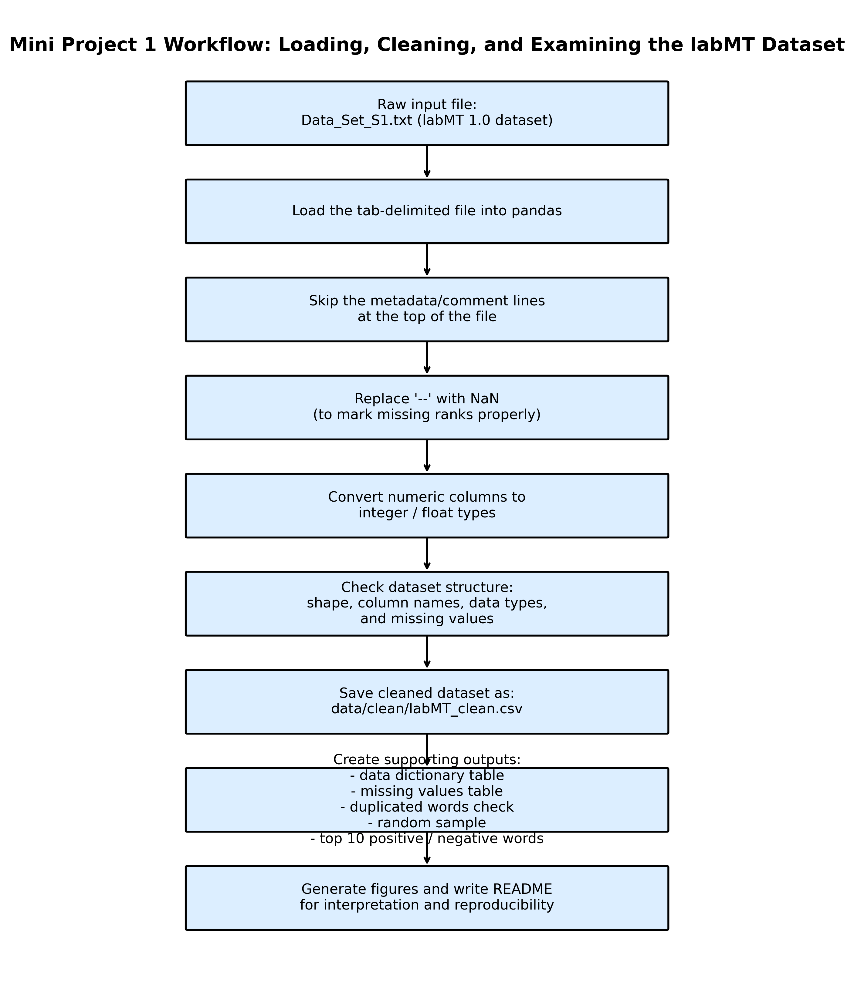

**Figure 1. Mini Project 1 workflow for loading, cleaning, checking, and examining the labMT dataset.**

This workflow is useful because it makes the process transparent. It also shows how the cleaned dataset, tables, and figures were produced from the original input file.

---

## 1.4 Data Dictionary

The data dictionary explains what each column represents, what type of data it contains, and whether it includes missing values. This helps make the dataset more transparent and easier to interpret.

**Table 1. Data dictionary for the cleaned labMT dataset.**

| Column | Description | Type | Missingness |
|---|---|---|---|
| `word` | The English word evaluated in the labMT dataset. | text | No missing values |
| `happiness_rank` | The rank of the word based on its average happiness score. | integer | No missing values |
| `happiness_average` | The average happiness score of the word on a 1–9 scale. | float | No missing values |
| `happiness_standard_deviation` | The standard deviation of happiness ratings, showing disagreement among raters. | float | No missing values |
| `twitter_rank` | The frequency rank of the word in the Twitter corpus. | float | Missing when the word is not ranked in the Twitter corpus |
| `google_rank` | The frequency rank of the word in the Google Books corpus. | float | Missing when the word is not ranked in the Google Books corpus |
| `nyt_rank` | The frequency rank of the word in The New York Times corpus. | float | Missing when the word is not ranked in the NYT corpus |
| `lyrics_rank` | The frequency rank of the word in the song lyrics corpus. | float | Missing when the word is not ranked in the lyrics corpus |

The table shows that missing values only appear in the corpus rank columns. This confirms that missingness is part of the dataset structure rather than a general cleaning error.

---

## 1.5 Sanity Checks

I used several sanity checks to make sure the cleaned dataset behaved as expected.

First, I checked for duplicated words. No duplicated words were found, which suggests that each row represents a unique word in the lexicon.

Second, I inspected a random sample of 15 rows. This helped confirm that the file was loaded correctly, the columns were aligned, and the numeric values were converted properly.

Third, I identified the most positive and most negative words according to `happiness_average`. This check is useful because the words at both ends of the scale should broadly match intuitive expectations. For example, the most positive words include words such as `laughter`, `happiness`, `love`, and `joy`. The most negative words include words such as `terrorist`, `suicide`, `rape`, and `murder`.

These results broadly make sense because the emotional direction of these words matches common social expectations. However, “making sense” does not mean that the scores are universally correct. Word meanings can still change depending on context, culture, and usage.

The sanity check outputs were saved in the `tables/` folder.

---

## 1.6 Exploring Happiness Scores

To better understand the structure of the labMT dataset, I first examined the distribution of `happiness_average`.

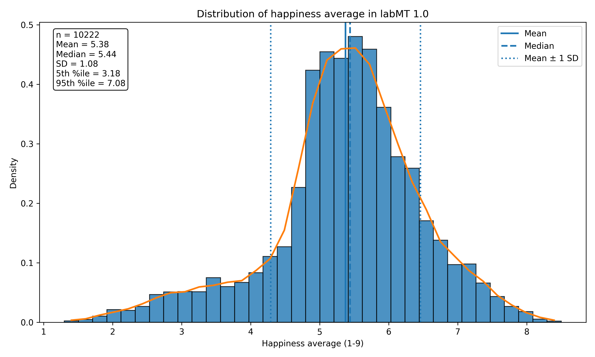

**Figure 2. Distribution of happiness average in labMT 1.0.**

The distribution shows that most words are clustered around the middle of the 1–9 scale. The mean happiness score is **5.38**, and the median is **5.44**, which means that the dataset is slightly above the neutral middle point. The standard deviation is **1.08**, showing that the scores are spread out but not evenly across the whole scale.

The 5th percentile is **3.18**, and the 95th percentile is **7.08**. This means that very negative and very positive words exist, but they are not the majority of the dataset.

This matters because labMT is not only made of emotionally extreme words. It also contains many ordinary words with moderate happiness scores. This is important for later analysis, because review-level happiness scores are produced by averaging many matched words, not only by counting very emotional words.

---

## 1.7 Most Positive and Most Negative Words

The highest-scoring words in labMT are strongly connected to positive emotion.

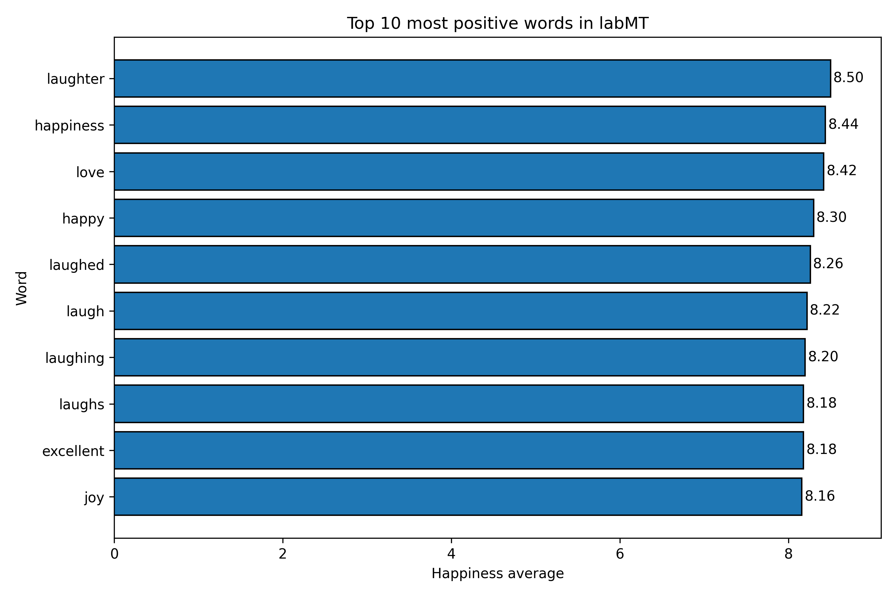

**Figure 3. Top 10 most positive words in labMT.**

The most positive words include `laughter`, `happiness`, `love`, `happy`, and `joy`. These words are clearly connected to positive emotional meaning. This supports the idea that the happiness scale captures a basic and intuitive form of emotional valence.

However, it is also noticeable that several of the top words are variations of the same root, such as `laughter`, `laughed`, `laugh`, `laughing`, and `laughs`. This shows that labMT treats word forms separately. This can be useful, but it also means that related word families may appear repeatedly in the high-scoring end of the lexicon.

The lowest-scoring words are mostly connected to death, violence, fear, and suffering.

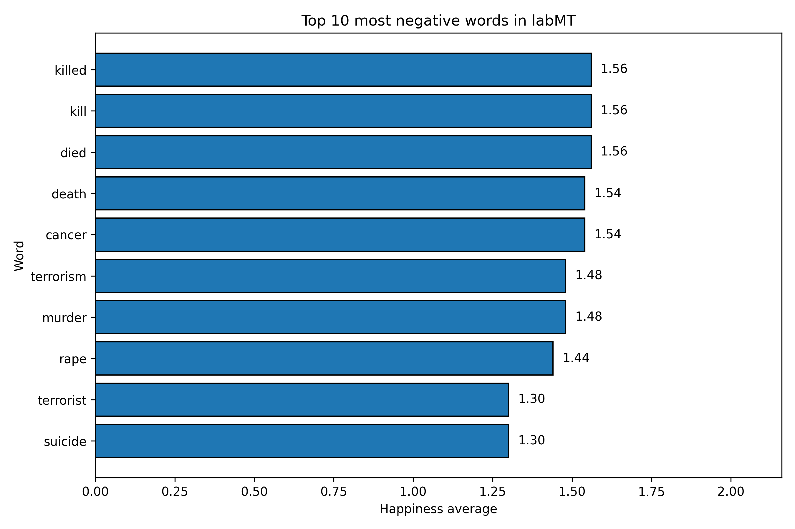

**Figure 4. Top 10 most negative words in labMT.**

The most negative words include `terrorist`, `suicide`, `rape`, `murder`, `terrorism`, `cancer`, and `death`. These words broadly match common expectations of negative emotional valence.

At the same time, these examples show one important limitation of labMT: it scores words in isolation. A word such as `cancer` is strongly negative in general, but the meaning of a full sentence still depends on context. This becomes especially important when labMT is later applied to movie reviews, where irony, criticism, and narrative context can affect meaning.

---

## 1.8 Corpus Rank Coverage and Missingness

The corpus rank columns show whether words appear in the top-ranked words of different corpora. I examined both coverage and missingness for the four corpus rank columns.

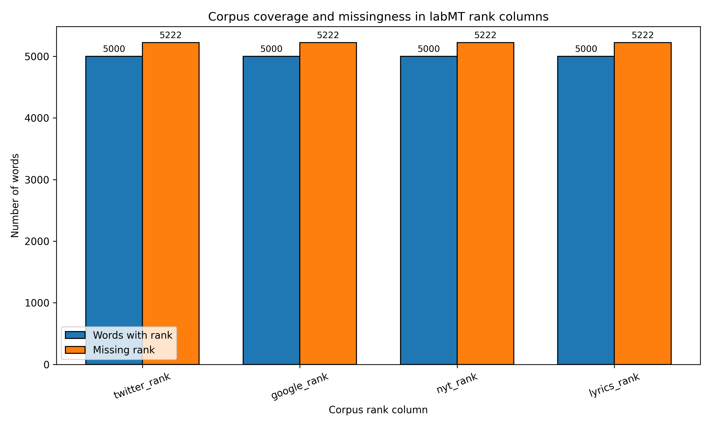

**Figure 5. Corpus coverage and missingness in labMT rank columns.**

Each corpus rank column contains ranks for **5,000 words** and missing values for **5,222 words**. This pattern shows that the missing values are not random errors. They are built into the structure of the dataset: each rank column only covers the words that appear in the top list for that specific corpus.

This is important because missing values should not simply be interpreted as a problem. Instead, they tell us something about corpus coverage. A word may exist in labMT but not be frequent enough to appear in a particular corpus ranking.

This also connects to the later application of labMT. If a corpus has many words that do not appear in the lexicon, then the happiness score may only represent part of the text. Therefore, corpus coverage is important when interpreting hedonometer results.

---

## 1.9 Happiness Average and Rating Disagreement

The dataset also includes `happiness_standard_deviation`, which shows how much raters disagreed about each word’s happiness score. I used this to examine whether some types of words are more ambiguous than others.

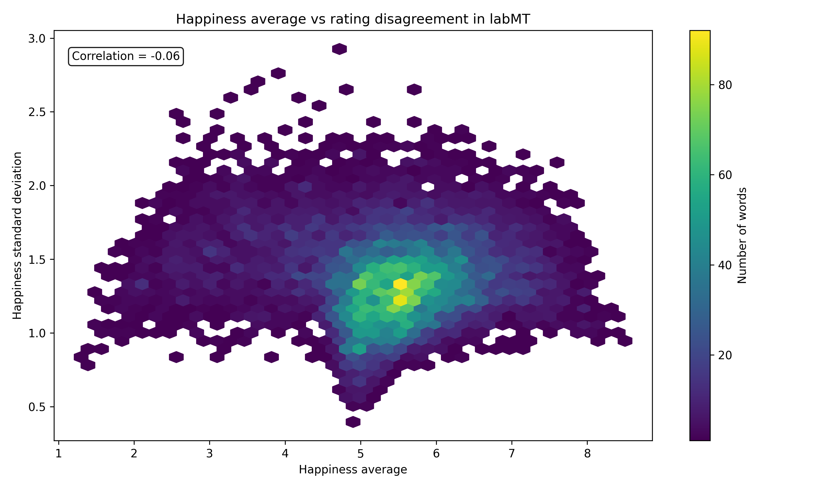

**Figure 6. Happiness average vs rating disagreement in labMT.**

The plot shows the relationship between the average happiness score and the standard deviation of ratings. The correlation is very weak (**-0.06**), which means there is no strong linear relationship between happiness level and disagreement.

Most words cluster around happiness scores between about 5 and 6, with standard deviations around 1.0 to 1.5. This suggests that many words are moderately positive or neutral, but raters still vary in how they interpret them.

The figure is useful because it reminds us that a happiness score is not a perfectly fixed meaning. It is an average of human judgments. Some words may be easier to agree on, while others may be more context-dependent or ambiguous.

---

## 1.10 Critical Reflection on labMT

The labMT dataset is useful because it offers a simple and reproducible way to measure emotional language at scale. Since each word has a fixed happiness score, the lexicon can be applied to large text corpora in a transparent way.

At the same time, this method has clear limitations. LabMT scores words individually, so it cannot fully capture context, negation, sarcasm, irony, or narrative meaning. For example, a word with a positive score can appear in a negative sentence, and a negative word can appear in a discussion that is not emotionally negative overall.

The dataset also reflects the assumptions of its collection process. The scores are based on human ratings, and those ratings may be influenced by cultural background, language norms, and interpretation habits. Therefore, labMT should be used as a useful analytical tool, but not as a perfect measure of emotion.

This critical understanding is important for Part 2. When applying labMT to IMDb movie reviews, the scores should be interpreted as broad indicators of emotional language, not as complete readings of meaning.

---

# Part 2: Applying labMT to IMDb Movie Reviews--To what extent can the labMT hedonometer distinguish between positive and negative IMDb movie reviews?

Part 2 applies the cleaned labMT lexicon from Part 1 to the IMDb Large Movie Review Dataset. The goal is to test whether labMT happiness scores can distinguish between reviews that are labelled as positive and reviews that are labelled as negative.

The research question for this part is:

**To what extent can the labMT hedonometer distinguish between positive and negative IMDb movie reviews, and what does this reveal about the limits of lexicon-based sentiment analysis?**

This question is useful because IMDb reviews already contain a sentiment distinction. By comparing the existing positive/negative label with the happiness scores produced by labMT, I can examine how well a word-level lexicon works when it is applied to real review texts. At the same time, I do not treat statistical significance as enough on its own. Because the IMDb dataset is large, even small differences can become very stable. Therefore, I also consider the size of the difference, the overlap between groups, and the limits of interpreting review-level sentiment through individual word scores.

---

## 2.1 Corpus and Data Preparation

The corpus used in this part is the IMDb Large Movie Review Dataset. The raw dataset is organised into `train` and `test` folders, and each split contains positive and negative review folders. Each review is stored as a separate text file.

To make the dataset easier to analyse, I converted the raw text files into a structured CSV file. For each review, I extracted the review text and created metadata columns including `review_id`, `split`, `sentiment`, `rating`, and `word_count`.

The processed IMDb review dataset was saved as:

```text
data/processed/imdb_reviews_processed.csv
```

This step turns the raw folder structure into a table that can be used for scoring and comparison.

---

## 2.2 IMDb Review Scoring Workflow

The scoring workflow connects the IMDb corpus to the cleaned labMT lexicon from Part 1.

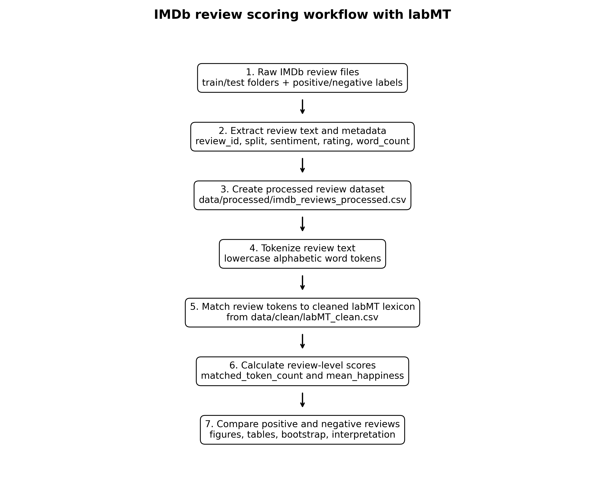

**Figure 7. IMDb review scoring workflow with labMT.**

First, each review text was tokenised into lowercase alphabetic words. Then each token was matched against the cleaned labMT lexicon. For every review, I calculated two main values:

- `matched_token_count`: the number of review tokens that were found in labMT.
- `mean_happiness`: the average labMT happiness score of all matched tokens in the review.

The scored dataset was saved as:

```text
data/processed/imdb_reviews_scored.csv
```

This creates one happiness score per review, which can then be compared across positive and negative IMDb labels.

---

## 2.3 Main Comparison: Positive and Negative Reviews

The first comparison looks at whether positive IMDb reviews receive higher labMT happiness scores than negative reviews.

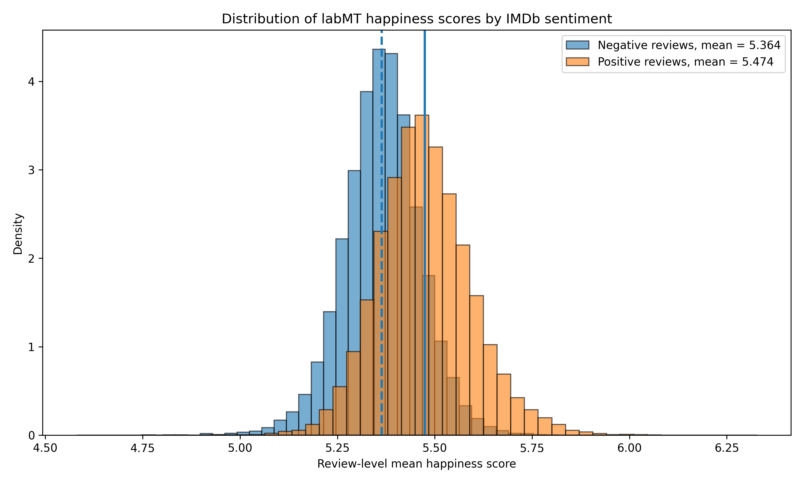

**Figure 8. Distribution of labMT happiness scores by IMDb sentiment.**

The distribution shows that positive reviews have higher labMT happiness scores on average than negative reviews. The mean score for positive reviews is **5.474**, while the mean score for negative reviews is **5.364**. The observed mean difference is therefore **0.110**.

This suggests that labMT can detect a difference between positive and negative reviews at the aggregate level. However, the two distributions still overlap substantially. This means that labMT should not be understood as a perfect classifier for individual reviews. It can show a broad group-level tendency, but many individual reviews still fall in a shared middle range.

**Table 2. Summary statistics by IMDb sentiment.**

| Sentiment label | Number of reviews | Mean happiness | Interpretation |
|---|---:|---:|---|
| Negative reviews | 25,000 | 5.364 | Lower average labMT happiness score |
| Positive reviews | 25,000 | 5.474 | Higher average labMT happiness score |

The table summarises the main comparison between the two IMDb sentiment groups. Positive reviews have a higher average labMT happiness score than negative reviews, with an observed difference of about **0.110**. This supports the idea that labMT can detect a group-level sentiment difference, although the size of the difference is still modest.

---

## 2.4 Boxplot Comparison

To make the comparison clearer, I also used a boxplot to compare the review-level happiness scores of the two sentiment groups.

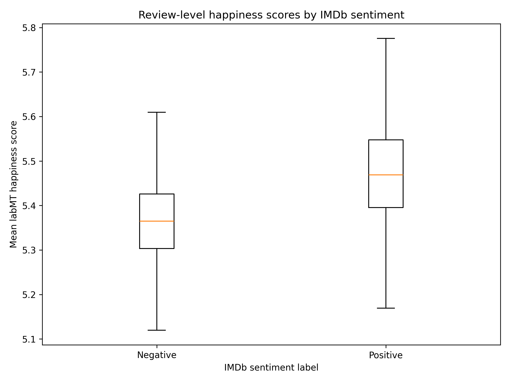

**Figure 9. Review-level happiness scores by IMDb sentiment.**

The boxplot shows that positive reviews tend to have higher happiness scores than negative reviews. The median and interquartile range for positive reviews are shifted upward compared with negative reviews.

At the same time, the two groups are not completely separated. This is important for the interpretation of the research question. It shows that labMT distinguishes the two groups in a broad statistical sense, but it does not fully separate positive and negative reviews at the individual level.

---

## 2.5 Bootstrap Analysis and the Problem of Large Dataset Significance

To check whether the observed mean difference is stable, I used bootstrap resampling. The bootstrap repeatedly resamples positive and negative reviews and recalculates the mean difference between the two groups.

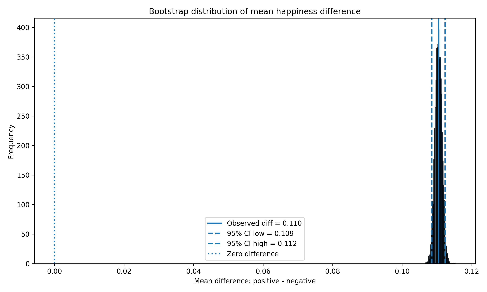

**Figure 10. Bootstrap distribution of the mean happiness difference between positive and negative reviews.**

The observed difference between positive and negative reviews is **0.110**. The 95% bootstrap confidence interval is:

```text
[0.108512, 0.112367]
```

Because this interval is entirely above zero, the difference is statistically stable. Positive reviews consistently score higher than negative reviews in labMT happiness.

However, this result needs to be interpreted carefully. The IMDb dataset contains **50,000 reviews**, so even a very small difference can appear highly stable. The confidence interval tells us that the average difference is unlikely to be caused by random sampling noise, but it does not mean that the effect is large or that labMT can strongly classify individual reviews. The difference is statistically stable, but practically modest.

---

## 2.6 Small-Sample Stability Check

Because the full dataset is very large, I added a small-sample stability check. Instead of relying only on all 50,000 reviews, I repeatedly sampled **1,000 positive reviews and 1,000 negative reviews** and recalculated the mean difference. This process was repeated **500 times**.

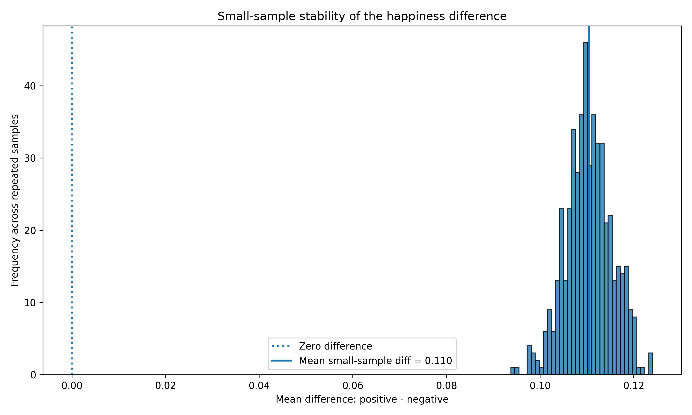

**Figure 11. Small-sample stability of the happiness difference.**

The mean small-sample difference was **0.110**, very close to the full-dataset result. Across the 500 repeated samples, the minimum difference was **0.094** and the maximum difference was **0.124**. The proportion of samples with a positive difference was **1.0**, meaning that in every repeated sample, positive reviews still scored higher than negative reviews.

This strengthens the interpretation because the result is not only visible in the full dataset. Even in smaller balanced samples, the direction of the difference remains stable. However, the size of the difference remains modest, so the conclusion should still be cautious: labMT captures a consistent but small aggregate signal.

**Table 3. Bootstrap and small-sample stability results.**

| Check | Result | Interpretation |
|---|---:|---|
| Observed mean difference | 0.110 | Positive reviews score higher than negative reviews |
| Bootstrap 95% CI | [0.1085, 0.1124] | The average difference is statistically stable |
| Small-sample repeats | 500 | The result was tested across repeated smaller samples |
| Sample size per repeat | 1,000 positive + 1,000 negative | Avoids relying only on the full 50,000-review dataset |
| Mean small-sample difference | 0.110 | Very close to the full-dataset result |
| Minimum small-sample difference | 0.094 | All repeated samples still showed a positive difference |
| Maximum small-sample difference | 0.124 | The difference remained within a narrow range |
| Proportion of positive differences | 1.0 | Positive reviews scored higher in every repeated sample |

This table is important because the full IMDb dataset is very large. A narrow confidence interval alone could make the result look more meaningful than it actually is. The small-sample check shows that the direction of the difference remains stable even when using smaller balanced samples, but the effect size is still small.

---

## 2.7 Matched Token Count and Measurement Reliability

I also examined how many words in each review were matched to labMT. This is important because a review-level happiness score is more reliable when it is based on a reasonable number of matched tokens.

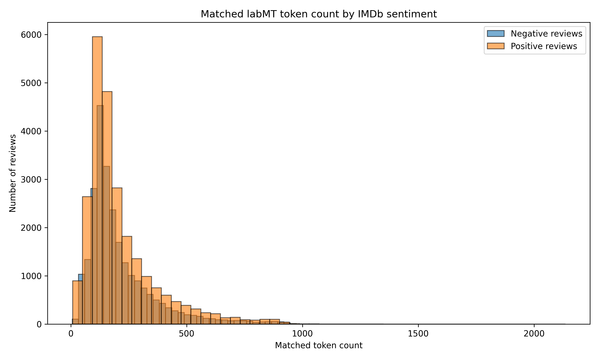

**Figure 12. Matched labMT token count by IMDb sentiment.**

The matched token count varies across reviews, mostly because review lengths are different. Many reviews have a moderate number of matched tokens, while some longer reviews have much higher matched token counts.

This check is important because labMT only scores the words that appear in its lexicon. If a review had very few matched tokens, its `mean_happiness` score would be less reliable. In this dataset, the average matched token count is around **212**, which suggests that most reviews contain enough matched words to calculate a meaningful average score.

---

## 2.8 Review Length and Matched Tokens

To check whether matched token count is mainly related to review length, I compared `word_count` and `matched_token_count`.

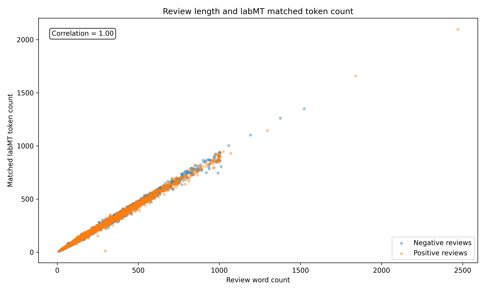

**Figure 13. Relationship between review length and matched labMT token count.**

The correlation between review word count and matched token count is **0.997**, which is extremely high. This means that longer reviews almost always have more matched labMT tokens.

This result is useful as a method check. It shows that the number of matched tokens is not random; it mostly follows the amount of text available in each review. At the same time, it also reminds us that longer reviews naturally provide more evidence for a stable average score than very short reviews.

---

## 2.9 Rating-Based Analysis

The IMDb file names also contain numerical ratings. I used these ratings as an additional angle to see whether labMT happiness scores increase with higher ratings.

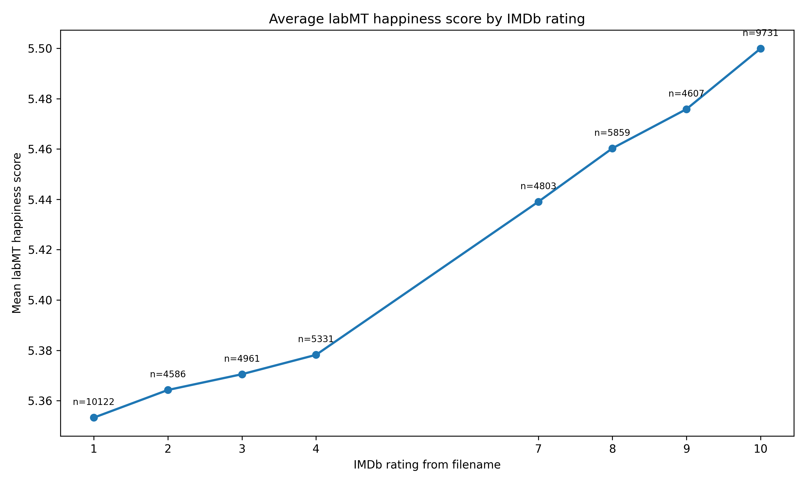

**Figure 14. Average labMT happiness score by IMDb rating.**

This figure provides a more detailed view than the binary positive/negative label alone. The average labMT happiness score generally increases as the IMDb rating increases. Low-rated reviews have lower average happiness scores, while high-rated reviews have higher scores.

This supports the main finding because the labMT score does not only separate positive and negative labels. It also follows the direction of the rating scale. However, the range is still narrow, so the result should be interpreted as a gradual aggregate trend rather than a strong prediction of exact ratings.

---

## 2.10 Mismatch Examples and Method Limits

In addition to aggregate statistics, I also selected mismatch examples: positive reviews with unusually low labMT scores and negative reviews with unusually high labMT scores. These examples were saved in:

```text
tables/mini2_table4_mismatch_examples.csv
```

These cases are useful because they show where a word-level lexicon can become limited. A positive review may receive a low happiness score if it discusses a dark, violent, or sad movie plot. A negative review may receive a higher score if it contains positive words in a sarcastic or disappointed way, such as saying that the reviewer “wanted to love” the film.

This shows that labMT can capture broad emotional patterns, but it cannot fully understand context, negation, sarcasm, plot description, or narrative meaning. This is especially important for movie reviews because reviewers often describe the content of a film, not only their own emotional evaluation of it.

**Table 4. Types of mismatch cases found in the IMDb analysis.**

| Mismatch type | What it means | Why it matters |
|---|---|---|
| Positive review with low labMT score | A review is labelled positive, but its word-level happiness score is relatively low | The review may describe dark, violent, or sad film content while still evaluating the film positively |
| Negative review with high labMT score | A review is labelled negative, but its word-level happiness score is relatively high | The reviewer may use positive words sarcastically, or mention positive expectations while criticising the film |
| High rating but moderate happiness | A review gives a high IMDb rating, but labMT score is not extremely high | A positive judgement does not always require strongly positive emotional vocabulary |
| Low rating but moderate happiness | A review gives a low IMDb rating, but labMT score is not extremely low | Negative evaluation may be expressed through context, comparison, or disappointment rather than strongly negative words |

These mismatch cases show why labMT should not be treated as a perfect sentiment classifier. The method scores words in isolation, while IMDb reviews often depend on context, tone, sarcasm, plot description, and reviewer judgement.

---

## 2.11 Part 2 Conclusion

Overall, the results suggest that labMT can detect a **small but consistent aggregate-level difference** between positive and negative IMDb reviews. Positive reviews have a higher mean happiness score than negative reviews, and this pattern also appears in the rating-based analysis.

However, the size of the difference is modest: about **0.11** on a 1–9 happiness scale. The bootstrap confidence interval is narrow, but this is partly because the dataset is very large. For this reason, statistical stability should not be confused with strong practical separation.

The small-sample stability check helps strengthen the result because the direction of the difference remains positive even in repeated balanced samples of 1,000 positive and 1,000 negative reviews. Still, the main conclusion remains cautious: labMT is useful as a broad hedonometer for detecting group-level emotional tendencies, but it should not be treated as a precise classifier for individual IMDb reviews.

The main finding is therefore not simply that positive reviews are “happier.” More importantly, the analysis shows both the usefulness and the limits of applying a word-level happiness lexicon to real review texts.


# Critical Reflection

This project shows that labMT can be useful for measuring emotional language at scale, but it also shows why lexicon-based sentiment analysis needs to be interpreted carefully.

In Part 1, I examined labMT before applying it to another corpus. This was important because labMT is not a neutral black-box tool. It is a word-level happiness lexicon based on human ratings, and each word is assigned a fixed average score. This makes the method transparent and reproducible, but it also creates limitations. Words are scored in isolation, so labMT cannot fully capture context, irony, negation, sarcasm, or changes in meaning across different situations.

In Part 2, the IMDb analysis showed that positive reviews have a higher average labMT happiness score than negative reviews. The result was consistent in the full dataset, the bootstrap analysis, and the small-sample stability check. However, the difference was small: about **0.11** on a 1–9 happiness scale. This means that labMT can detect a broad group-level tendency, but it should not be treated as a strong classifier for individual reviews.

One important issue is the size of the IMDb dataset. Because the dataset contains **50,000 reviews**, even a small mean difference can look very statistically stable. For this reason, I did not interpret the narrow confidence interval as proof of a strong effect. Instead, I treated it as evidence of a small but consistent aggregate signal. The small-sample stability check helped confirm that the direction of the difference was not only a result of using the full dataset, but the practical size of the difference still remains modest.

Another limitation is that movie reviews are complex texts. A positive review can describe death, violence, or sadness because the film itself has dark content. A negative review can contain positive words if the reviewer is being sarcastic or disappointed, for example saying that they “wanted to love” the film. In these cases, labMT may score the emotional tone of the words, but not the reviewer’s actual judgement of the movie.

Overall, the project suggests that labMT works best as a broad hedonometer rather than a precise sentiment classifier. It can reveal general emotional tendencies across many texts, but it cannot replace close reading or contextual interpretation. This is why the most important finding is not simply that positive reviews are “happier,” but that a transparent computational method can produce useful patterns while still having clear interpretive limits.


# How to Run the Code

This project can be reproduced by running the Python scripts in the `src/` folder. The scripts should be run from the root folder of the repository, not from inside the `src/` folder.

Before running the scripts, install the required Python packages:

```bash
pip install -r requirements.txt
```

The raw labMT dataset should be placed at:

```text
data/raw/Data_Set_S1.txt
```

For Part 2, the IMDb Large Movie Review Dataset should be downloaded and placed locally at:

```text
data/raw/aclImdb/
```

The raw IMDb dataset is not uploaded to this GitHub repository because it is large. It is ignored in `.gitignore`.

To reproduce the full project, run the scripts in this order:

```bash
python src/mini1_load_clean_labmt.py
python src/mini1_sanity_checks.py
python src/mini1_visualisations.py
python src/mini1_workflow_figure.py
python src/mini2_prepare_imdb.py
python src/mini2_score_reviews.py
python src/mini2_analysis_figures.py
```

The first four scripts reproduce Part 1. They clean the labMT dataset, generate sanity check tables, and create the Part 1 figures.

The last three scripts reproduce Part 2. They prepare the IMDb review corpus, calculate labMT happiness scores for each review, and generate the Part 2 figures and tables.

The main generated outputs are saved in:

```text
data/clean/
data/processed/
figures/
tables/
```

In particular, the final scored IMDb dataset is saved as:

```text
data/processed/imdb_reviews_scored.csv
```

The figures used in the README are saved in:

```text
figures/
```

The summary tables and supporting outputs are saved in:

```text
tables/
```

# AI Use Disclosure

I used AI tools, including ChatGPT, for limited support during this project. The main uses were planning the workflow, explaining coding errors, helping to debug Python scripts, and supporting the drafting and revision of README sections.

AI was especially useful when I needed to understand why code did not run correctly, how to organise the repository structure, and how to interpret outputs such as figures, bootstrap results, and confidence intervals. However, I did not use AI as a replacement for my own work. I checked the generated code, ran the scripts myself, inspected the outputs, and revised the written interpretation so that it matched my actual results.

The final project, including the research question, data processing, figures, interpretation, and repository organisation, remains my responsibility.

---

# Bibliography

Dodds, Peter Sheridan, Kameron Decker Harris, Isabel M. Kloumann, Catherine A. Bliss, and Christopher M. Danforth. 2011. “Temporal Patterns of Happiness and Information in a Global Social Network: Hedonometrics and Twitter.” *PLOS ONE* 6 (12): e26752. https://doi.org/10.1371/journal.pone.0026752

Maas, Andrew L., Raymond E. Daly, Peter T. Pham, Dan Huang, Andrew Y. Ng, and Christopher Potts. 2011. “Learning Word Vectors for Sentiment Analysis.” In *Proceedings of the 49th Annual Meeting of the Association for Computational Linguistics: Human Language Technologies*, 142–150.

Stanford AI Lab. n.d. “Large Movie Review Dataset.” Accessed 2026. 